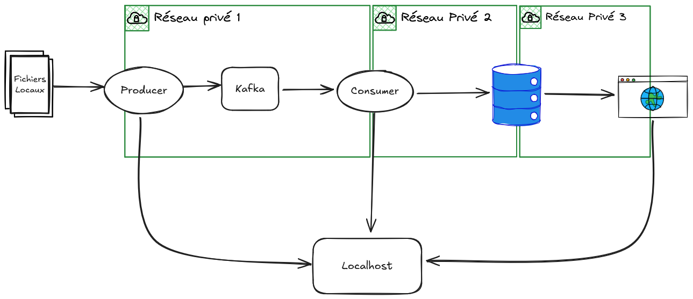

# Projet de Conteneurisation - Streaming Analytics Platform

**Objectif** : Démonstration des bonnes pratiques de conteneurisation avec Docker en créant une plateforme de streaming analytics complète.

Ce projet illustre la conteneurisation d'une architecture microservices complexe utilisant Apache Kafka, Spark et PostgreSQL.

## 🎯 Objectif du Projet

Le but principal est de **conteneuriser une application de streaming analytics** en respectant les meilleures pratiques Docker :
- Isolation des services
- Gestion des réseaux et volumes
- Configuration sécurisée
- Optimisation des performances
- Orchestration multi-conteneurs

## 📋 Installation et Démarrage

### Étape 1 : Installation
```bash
git clone git@github.com:yahia-adam/streaming-analytics-docker.git && cd streaming-analytics-docker
```

### Étape 2 : Configuration

```bash
mv env.exemple .env && cat .env
```


## 🎖️ Utilisaation

### Démarrage

```bash
docker compose up
```

### Streamlit Dashboard
```bash
http://localhost:8501
```
### Producer Spark UI
```bash
http://localhost:4040
```
### Consumer Spark UI

```bash
http://localhost:4041
```

## 🏗️ Architecture Conteneurisée

### Structure des Conteneurs



### Réseaux Docker

- **engnetwork** (interne) : Communication Kafka/Spark
- **dbNetwork** (interne) : Accès base de données
- **webNetwork** (public) : Interface utilisateur

## 🔧 Bonnes Pratiques de Conteneurisation Implémentées

### 🐳 Images Docker

```dockerfile
# Utilisation d'images base officielles
FROM openjdk:11
FROM python:3.10
FROM postgres:15

# Optimisation des couches
RUN curl -fsSL https://archive.apache.org/dist/spark/... | tar -xz -C /opt && \
    ln -s /opt/spark-3.5.0-bin-hadoop3 /opt/spark
```

### 🔒 Sécurité

- **Gestion des secrets** : Variables d'environnement via `.env`
- **Isolation réseau** : Réseaux internes et publics séparés
- **Images officielles** : Utilisation d'images maintenues et sécurisées
- **Principe du moindre privilège** : Limitation des accès réseau

### 📊 Monitoring et Debugging

```bash
# Surveillance des conteneurs
docker-compose ps
docker stats

# Accès aux logs
docker-compose logs [service]
docker-compose logs -f producer

# Inspection des réseaux
docker network ls
docker network inspect streaming-analytics-docker_engnetwork

# Inspection des volumes
docker volume ls
docker volume inspect streaming-analytics-docker_postgres_data
```

### 🔄 Gestion du Cycle de Vie

```bash
# Redémarrer un service spécifique
docker-compose restart producer

# Mise à jour d'un service
docker-compose build producer
docker-compose up -d producer

# Scaling (si supporté)
docker-compose up -d --scale consumer=2
```

## 🎯 Commandes Utiles

### Développement

```bash
# Reconstruire et redémarrer
docker-compose down && docker-compose build && docker-compose up -d

# Accéder à un conteneur
docker-compose exec postgres bash
docker-compose exec producer bash

# Copier des fichiers
docker-compose cp local_file producer:/app/
```

### Production

```bash
# Démarrage en arrière-plan
docker-compose up -d

# Mise à jour sans interruption
docker-compose up -d --no-recreate

# Backup des données
docker-compose exec postgres pg_dump -U yelp_user yelp_analytics > backup.sql
```

### Nettoyage

```bash
# Arrêter tous les services
docker-compose down

# Supprimer les volumes (⚠️ perte de données)
docker-compose down -v

# Nettoyage complet du système
docker system prune -af
docker volume prune -f
```

## 📁 Structure du Projet Conteneurisé

```
.
├── Consumer/
│   ├── Dockerfile                 # Image Spark Consumer
│   └── target/scala-2.12/         # JAR compilé
├── DataVisualisation/
│   ├── Dockerfile                 # Image Streamlit
│   ├── requirements.txt           # Dépendances Python
│   └── src/                       # Code source
├── Producer/
│   ├── Dockerfile                 # Image Spark Producer
│   └── target/scala-2.12/         # JAR compilé
├── init/
│   └── init.sql                   # Script init PostgreSQL
├── yelp_dataset/                  # Dataset décompressé
├── docker-compose.yml             # Orchestration
├── .env                           # Configuration
└── README.md                      # Documentation
```

## 🚀 Fonctionnalités de Conteneurisation

### Multi-Stage Build (Recommandé)
```dockerfile
FROM openjdk:11-jdk AS builder
WORKDIR /app
COPY . .
RUN ./gradlew build

FROM openjdk:11-jre-slim AS runtime
COPY --from=builder /app/target/*.jar /app/
```

### Health Checks
```yaml
healthcheck:
  test: ["CMD-SHELL", "curl -f http://localhost:4040 || exit 1"]
  interval: 30s
  timeout: 10s
  retries: 3
```

### Resource Limits
```yaml
deploy:
  resources:
    limits:
      cpus: '2.0'
      memory: 2G
    reservations:
      cpus: '1.0'
      memory: 1G
```

## 🔍 Validation du Projet

Vérifiez que votre conteneurisation fonctionne :

```bash
# Tous les conteneurs sont UP
docker-compose ps

# Les services communiquent
docker-compose exec producer ping kafka
docker-compose exec consumer ping postgres

# Les données circulent
docker-compose logs producer | grep "Batch"
docker-compose logs consumer | grep "Processing"

# L'interface web est accessible
curl http://localhost:8501
```

## 🎓 Compétences Démontrées

Ce projet met en évidence :
- **Dockerisation** d'applications complexes
- **Orchestration** multi-conteneurs
- **Gestion des réseaux** et isolation
- **Persistance des données** avec volumes
- **Configuration** externalisée
- **Monitoring** et debugging
- **Sécurité** des conteneurs
- **Optimisation** des performances

---

**Note** : Ce projet est conçu pour démontrer une maîtrise complète de la conteneurisation Docker dans un contexte d'architecture microservices.
